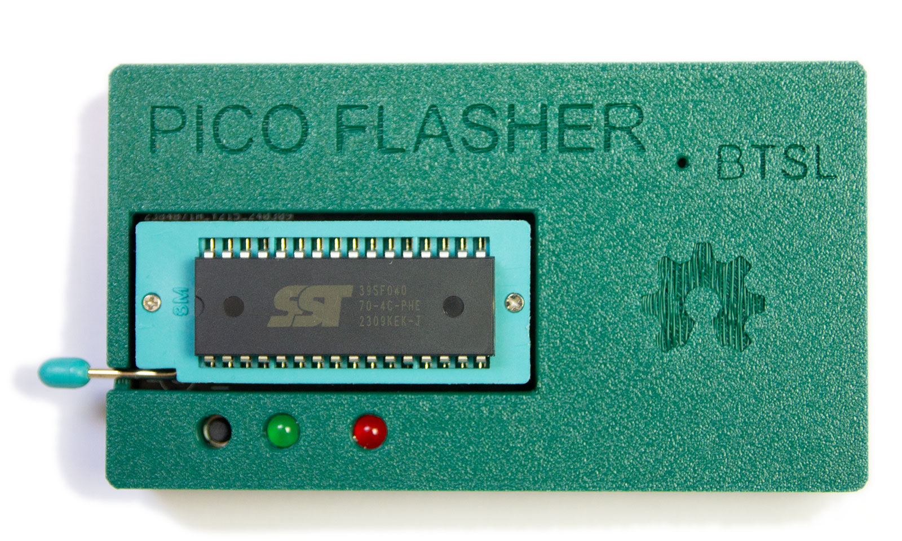
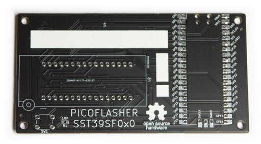
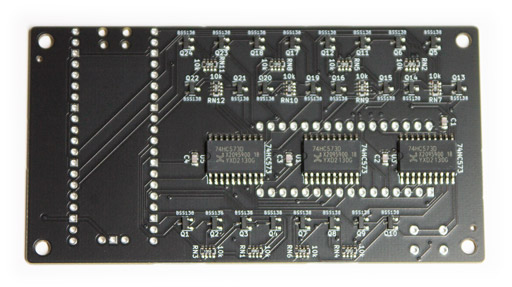

# PICO-SST39SF0x0 Programmer

## Purpose

This open hardware project aims users to produce a low-cost flasher for the
[SST39SF0x0 type](https://ww1.microchip.com/downloads/en/DeviceDoc/20005022C.pdf) 
of ROM chips. The flasher revolves around the cheap
[Raspberry PICO](https://www.raspberrypi.com/products/raspberry-pi-pico/) device.

Besides general read/write/erase functionality for the SST39SF0x0 type of ROM chips,
the software and tools delivered with the PICO-SST39SF0x0 Programmer tend to cater
to a number of projects involving the venerable P2000T and P2000M, both early Philips 
home computers of the 1980s. See the list below for the projects that use the
PICO-SST39SF0x0 Programmer flasher.

* [P2000T Cartridges](https://github.com/ifilot/p2000t-cartridges): A set of homebrewn
  cartridges designed for the P2000T. These cartridges all use SST39SF0x0 type of
  ROM chips.
* [P2000T Tape Monitor](https://github.com/ifilot/p2000t-tape-monitor): A SLOT2
  datacartridge for loading programs into the P2000T.

Nevertheless, this is a general purpose product and you are able to flash and kind of data onto the ROM chips.

## Images

PCB frontside | PCB backside
------------- | ------------
 | 

## Contents

* [Case](case): Set of .stl files to print a handy case for your flash device.
* [Firmware](firmware): Firmware for your PICO to interface with the GUI.
* [GUI](gui): Qt-based GUI to interface with your PICO.
* [PCB](pcb): Kicad files to produce the PICO flash device and the PLCC32 adapter board.
* [Scripts](scripts): Number of Python scripts the correct working of your PICO
  device.

## Obtaining pre-built binaries

Download the latest version of the binaries via the links below.

* [Firmware (.uf2 file)](https://github.com/ifilot/pico-sst39sf0x0-programmer/releases/latest/download/pico-sst39sf0x0-programmer-firmware.uf2)
* [GUI Installer](https://github.com/ifilot/pico-sst39sf0x0-programmer/releases/latest/download/pico-sst39sf0x0-programmer-installer-win64.exe)

## License

* All software is shared under the [GPL v3 license](https://www.gnu.org/licenses/gpl-3.0).
* All hardware (e.g. KiCAD files and .stl files) are shared under the [CC-BY-SA 4.0 license](https://creativecommons.org/licenses/by-sa/4.0/).
