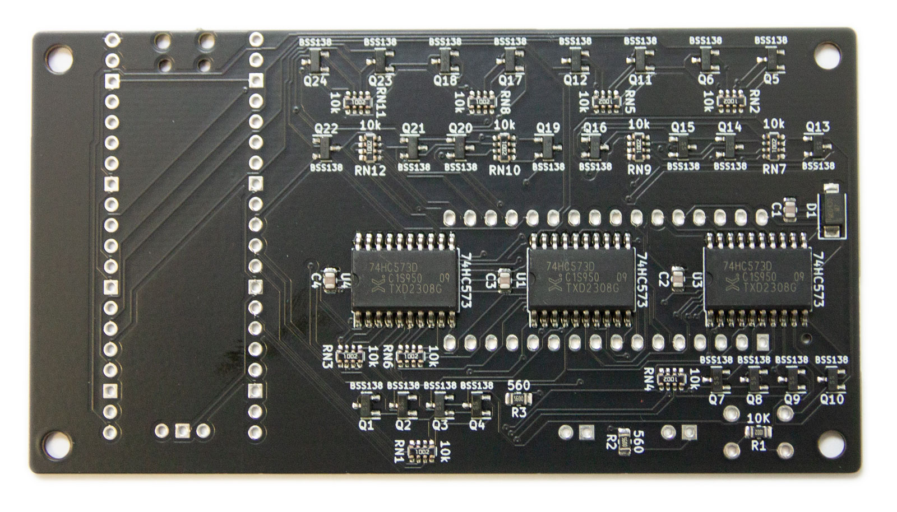

# PICO-SST39SF0x0 Programmer

> [!NOTE]  
> Wish to buy an assembled device? Feel free to contact me at ivo@ivofilot.nl. Price will be around €20,00. Will ship from the Netherlands.

> [!TIP]
> There also exists [a command-line tool](https://github.com/ifilot/pico-flasher-cli) to interface with the PICO-SST39SF0x0 Programmer.

> [!CAUTION]  
> Whenever possible, avoid using USB hubs to connect your **PICO-SST39SF0x0 Programmer**. 
> USB hubs can sometimes cause instability in the serial connection, which may 
> lead to crashes or unexpected program behavior.

## Obtaining pre-built binaries

Download the latest version of the binaries via the links below.

* [Firmware PICO (.uf2 file)](https://github.com/ifilot/pico-sst39sf0x0-programmer/releases/latest/download/pico-sst39sf0x0-programmer-firmware.uf2)
* [Firmware PICO2 (.uf2 file)](https://github.com/ifilot/pico-sst39sf0x0-programmer/releases/latest/download/pico2-sst39sf0x0-programmer-firmware.uf2)
* [GUI Installer](https://github.com/ifilot/pico-sst39sf0x0-programmer/releases/latest/download/pico-sst39sf0x0-programmer-installer-win64.exe)

## Purpose

This open hardware project aims users to produce a low-cost flasher for the
[SST39SF0x0 type](https://ww1.microchip.com/downloads/en/DeviceDoc/20005022C.pdf) 
of ROM chips. The flasher revolves around the cheap
[Raspberry PICO](https://www.raspberrypi.com/products/raspberry-pi-pico/) device.

Besides general read/write/erase functionality for the SST39SF0x0 type of ROM
chips, the software and tools delivered with the PICO-SST39SF0x0 Programmer tend
to cater to a number of projects involving the venerable 
[P2000T and P2000M](https://en.wikipedia.org/wiki/Philips_P2000), both early 
Philips home computers of the 1980s. See the list below for the projects that
use the PICO-SST39SF0x0 Programmer flasher.

* [P2000T Cartridges](https://github.com/ifilot/p2000t-cartridges): A set of
  homebrew cartridges designed for the P2000T. These cartridges all use
  SST39SF0x0 type of ROM chips.
* C64 Multirom

Nevertheless, this is a general purpose product and you are able to flash and
kind of data onto the ROM chips.

> [!TIP]  
> If you do not like seeing these ROM files being displayed, you can hide them
> via `Edit > Settings`.

## Device

The fully assembled device will look as seen in the image below. A ZIF-style
socket is used to insert the SST39SF0x0 chip. A reset button button is exposed
which will reset the device. The green and red LEDs will be on during read and
write operations, respectively. At the top-right part of the device, an access
hole is made to insert a long thin wire to press on the `bootsel` button of the
Raspberry Pi PICO. When this button is pressed down and a USB cable is inserted,
the PICO will expose a file system allowing the user to upload the firmware
to the device.

Inside the enclosure is a single PCB that hosts the PICO, the ZIF cartridge
and a number of chips. Since the GPIO pins on the PICO are 3.3V, extensive use
of level shifters is made to hook up the PICO to the SST39SF0x0 chip, whose
pins operate at the 5V logic level. To set the address on the SST39SF0x0 chip,
three 74HC573 chips are being used (U2-U4). A diode (D1) acts as the reverse
polarity protection in the event the user would place the chip in the wrong
direction.

PCB frontside | PCB backside
------------- | ------------
 | 

## GUI

To interface with the device, a GUI is written using the 
[Qt framework](https://www.qt.io/). The GUI scans for all USB devices connected
to the computer with a hardware signature matching the Raspberry Pi PICO. Upon
a match, it tries to access the device. Interfacing with the device occurs via
a [serial communication (COM) port](https://en.wikipedia.org/wiki/COM_(hardware_interface)).
By means of a number of [simple 8-byte command words](firmware/README.md),
instructions can be sent to the device and the corresponding response can be
received. One is not restricted to using the GUI to interface with the device.
An [example set of Python scripts](firmware/scripts) is provided to provide 
an alternative way to communicate with the PICO programmer.

> [!NOTE]  
> There is also a command-line tool available via
> [this repository](https://github.com/ifilot/pico-flasher-cli).

## Documentation and tutorials

A number of useful tutorials to work with the PICO programmer are provided
below.

* [Flashing the device / updating firmware](https://www.philips-p2000t.nl/tools/pico-sst39sf0x0-programmer.html#flashing-firmware-to-the-programmer)
* [Using the programmer to create copies of P2000T cartridges](https://www.philips-p2000t.nl/tools/pico-sst39sf0x0-programmer-slot1-adapter-board.html)
* [Using the PICO programmer in combination with the P2000T ZIF-cartridge](https://www.philips-p2000t.nl/cartridges/zif-cartridge.html#zif-cartridge)

## Schematics

[Download schematics as PDF](pcb/pico-sst39sf0x0-pcb/pico-sst39sf0x0-pcb.pdf)

## Contents

* [Case](case): Set of .stl files to print a handy case for your flash device.
* [Firmware](firmware): Firmware for your PICO to interface with the GUI.
* [GUI](gui): Qt-based GUI to interface with your PICO.
* [PCB](pcb): Kicad files to produce the PICO flash device and the PLCC32 adapter board.
* [Scripts](scripts): Number of Python scripts the correct working of your PICO
  device.

## License

* All software is shared under the [GPL v3 license](https://www.gnu.org/licenses/gpl-3.0).
* All hardware (e.g. KiCAD files and .stl files) are shared under the [CC-BY-SA 4.0 license](https://creativecommons.org/licenses/by-sa/4.0/).
