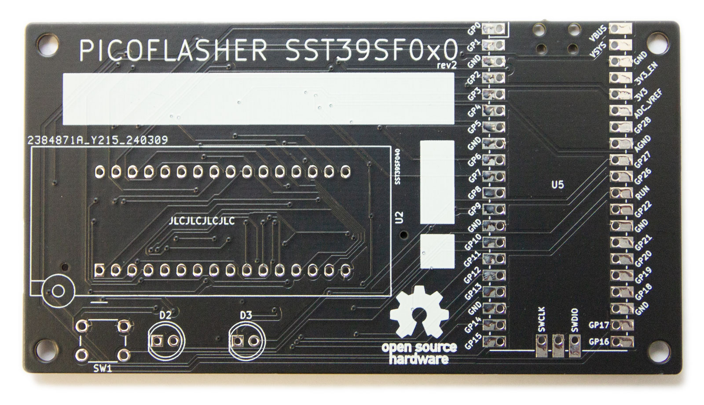

# PICO-SST39SF0x0 Programmer

## Purpose

This open hardware project aims users to produce a low-cost flasher for the
SST39SF0x0 type of ROM chips. The flasher revolves around the cheap
[Raspberry PICO](https://www.raspberrypi.com/products/raspberry-pi-pico/) device.

PCB frontside | PCB backside
------------- | ------------
 | 

## Contents

* [Case](case): Set of .stl files to print a handy case for your flash device.
* [Firmware](firmware): Firmware for your PICO to interface with the GUI.
* [GUI](gui): Qt-based GUI to interface with your PICO.
* [PCB](pcb): Kicad files to produce the PICO flash device and the PLCC32 adapter board.
* [Scripts](scripts): Number of Python scripts the correct working of your PICO
  device.

## Obtaining pre-built binaries

Download the latest version of the binaries via the links below.

### PICO firmmare 
* [Latest version](https://github.com/ifilot/pico-sst39sf0x0-programmer/releases/latest/download/pico-sst39sf0x0-programmer-firmware.uf2)

### GUI
* [Latest version Windows](https://github.com/ifilot/pico-sst39sf0x0-programmer/releases/latest/download/pico-sst39sf0x0-programmer-installer-win64.exe)

## License

* All software is shared under the [GPL v3 license](https://www.gnu.org/licenses/gpl-3.0).
* All hardware (e.g. KiCAD files and .stl files) are shared under the [CC-BY-NC-SA 4.0 license](https://creativecommons.org/licenses/by-nc-sa/4.0/).
